# ESP32APRS T-TWR Plus Project

ESP32APRS(T-TWR Plus) works in 3-modes: APRS internet gateway, digital repeater, tracker, with built-in TNC and radio transceiver. which is used with the ESP32-S3 LILYGO T-TWR Plus V2.0 board.

This project came about because a friend sent LILYGO T-TWR Plus for me to play with, so I started to develop the new APRS software again.
Has been designed to be easy to use,By displaying results on the screen Configuration via screen and rotary switch or config via web browser on mobile phone or computer.

## Screen short

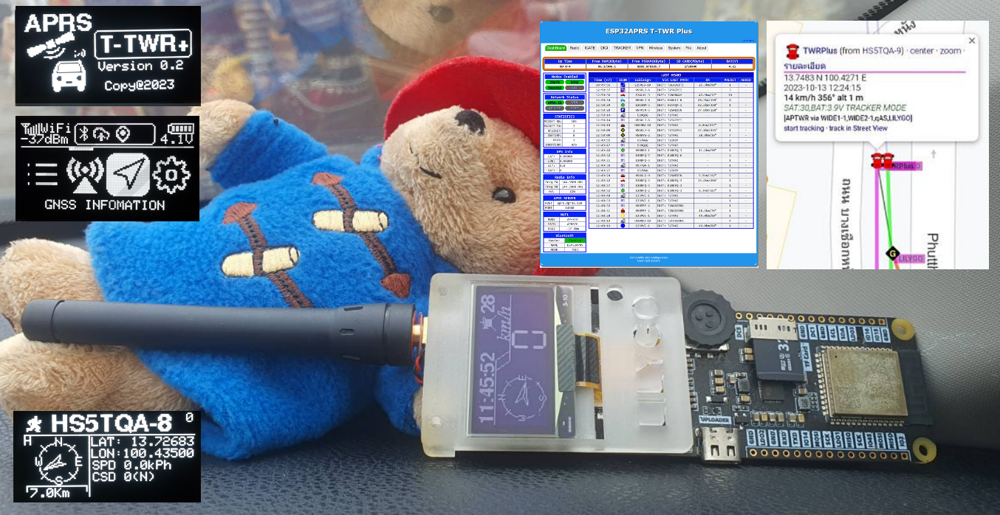

## Feature

* Supported hardware: LILYGO T-TWR Plus V2.0 (No modifications required)
* Supported RF: SA868 VHF/UHF model
* Support APRS internet gateway
* Support APRS digital repeater
* Support APRS tracker with fix position or smartbeacon mode from GNSS
* Using ESP-Arduino development on Visual studio code + Platform IO
* Support Bell202 1200bps AFSK
* Implementing software modem, decoding and encoding
* Support BLE:Bluetooth TNC2/KISS Mode
* Support monitor display menu icon and configuration
* Support Wi-Fi multi station or WiFi Access point
* Support rotary swich for select and key config overall
* support Web Service config and control system
* support filter packet rx/tx on igate,digi,tracker,display
* support audio filter BPF,HPF
* support status battery,wifi,gnss,bluetooth
* support VPN wireguard
* support global time zone
* support web service auth 
* support sd card
* display received and transmit packet on the LED and display OLED

### IGATE Mode feature
* Easy to select symbol icon on display config or webservice
* [RF2INET] RF to Internet gateway
* [INET2RF] Internet to RF gateway
* [POS2INET] Beacon Position to internet
* [POS2RF] Beacon Position to RF
* Support OBJECT name (use for multi station more SSID)
* Support generate PHG on web(Height,TX Power,Gain,Antt direction)
* Support Filter RF2INET and filter INET2RF
* Protect INET2RF packet not ax.25
* Protect RF2INET packet from rf/inet to inet loop
* Fix position or GPS move position
* Auto pass code

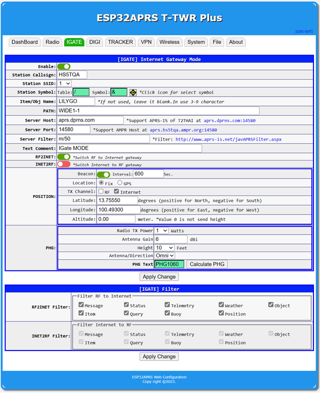

### TRACKER Mode feature
* Easy to select symbol icon on display config or webservice
* [POS2INET] Beacon Position to internet
* [POS2RF] Beacon Position to RF
* Support Item mode (name staion 3-9 charactor)
* Support smart beacon and two icon move and stop profile
* Support compress packet and cst
* Fix position or GPS move position
* Can send comment status for course/spd, altitude,battery
* Simultaneous repeater protection

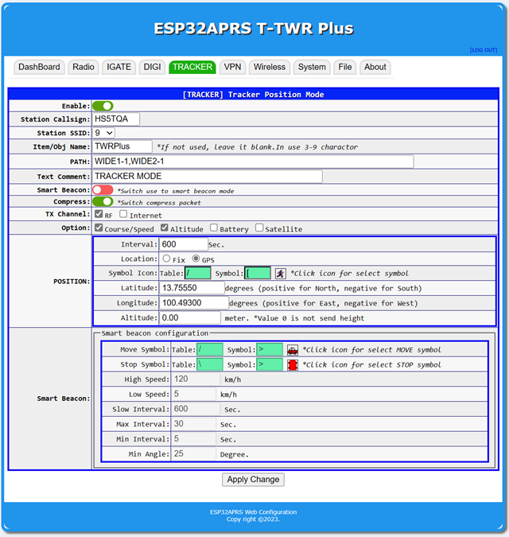

### DIGI Mode feature
* Easy to select symbol icon on display config or webservice
* [POS2INET] Beacon Position to internet
* [POS2RF] Beacon Position to RF
* Support generate PHG on web(Height,TX Power,Gain,Antt direction)
* Support Filter for repeater
* Fix position or GPS move position
* Repeat random delay of packet
* Simultaneous repeater protection
* Supoort PATH: WIDEn-N,TRACEn-N,RELAY,RFONLY,NOGATE,qA*

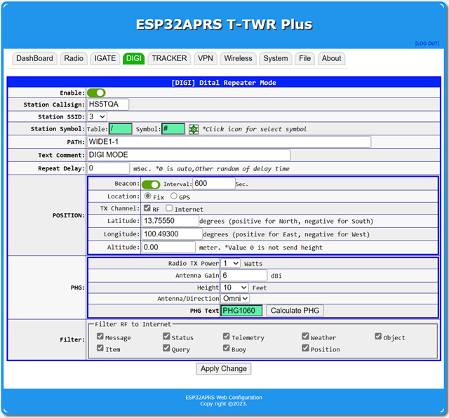

### Rotary encoder action in GUI
* Dashboard: dial up/down for select icon menu,push to select and push long 3sec to back/exit
* Check Box: push to toggle checked
* Text Box: push to enter charector and next charactor,doble push(click) to Blackspace,dial up/down for select charactor,push long 3sec for Exit edit
* Combo Box: push to enter/exit,dial up/down for select item

## Display Main Menu
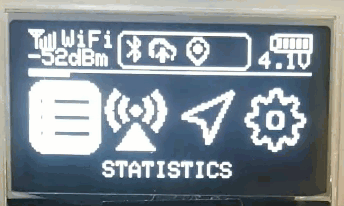  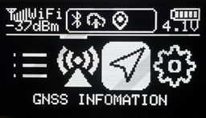 
```
|STATISTICS
|STATION LIST
|-push long >3sec for decode display aprs infomation,push click switch to raw packet
|GNSS INFOMATION
|-push long >3sec for switch info and compass/speed
|SYSTEM INFO
|SETTING
|QR Web Service
|-push long >3sec for switch QR WebService and WiFi AP connection
|ABOUT
```

## Display Config Menu MAP
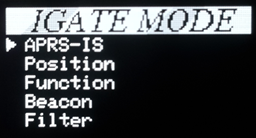 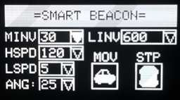 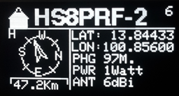
```
|WiFi/BT/RF
|-WiFi AP
|-WiFi Station
|-Bluetooth
|-RF Module

|APRS
|-IGATE MODE
|  |-APRS-IS
|  |-Position
|  |-Function
|  |-Beacon
|  |-Filter
|-TRACKER MODE
|  |-Position
|  |-Function
|  |-Option
|  |-Smart Beacon
|-DIGI MODE
|  |-Position
|  |-Function
|  |-Option
|  |-Filter

|SYSTEM
|-Save/Load
|  |-Save Config
|  |-Load Config
|  |-Factore Reset
|  |-REBOOT
|-OLED Setting
|-Display Filter
|-ABOUT
|  |-OTA Update
|  |-WiFi Status
|  |-Infomations
```

## ESP32APRS_T-TWR firmware installation (do it first time, next time via the web browser)
- 1.Connect the USB cable to the LILYGO T-TWR Plus.
- 2.Press the **PWR** button for one second to make sure the TWR is powered on
- 3.Press and hold the **BOOT** button (without releasing it), then press the **RST** button, then release the **RST** button, and finally release the **BOOT** button
- 4.[Download](https://github.com/nakhonthai/ESP32APRS_T-TWR/releases) firmware and open the program [ESP32 DOWNLOAD TOOL](https://www.espressif.com/en/support/download/other-tools), set it in the firmware upload program, set the firmware to ESP32APRS_TWR_Vxx.bin, location 0x10000 and partitions.bin at 0x8000 and bootloader.bin at 0x0000 and boot_app0.bin at 0xe000
- 5.Click the **START** button in the program and wait for the upload to complete
- 6.You can enter configuration mode in 3 ways:
-   6.1 Use rotary switch + display direct config in the menu icon `SETTING`
-   6.2 Default config then go to `WiFi AP SSID: ESP32APRS PASS: aprsthnetwork` or scan QR code in the menu icon `QR Web Service` (push long switch to WiFi QR connection) and open a web browser to the website. http://192.168.4.1 default `web auth USER: admin PASS: admin`
-   6.3 Default config then go to share or set router `WiFi SSID: APRSTH PASS: aprsthnetwork` or scan QR code in the menu icon 'QR Web Service' (push long switch to web browser) default `web auth USER: admin PASS: admin`
- 7.Push **BOOT** button long >100ms to manual TX Position in the tracker mode

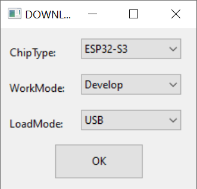 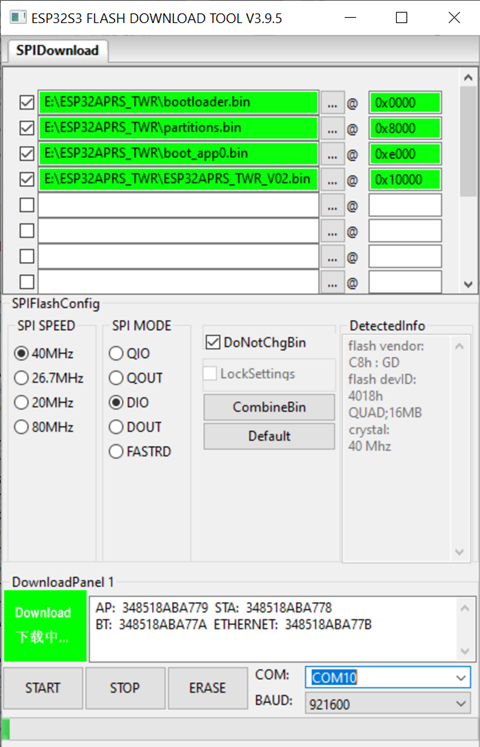


## ESP32 Flash Download Tools
https://www.espressif.com/en/support/download/other-tools


## PlatformIO Quick Start

1. Install [Visual Studio Code](https://code.visualstudio.com/) and [Python](https://www.python.org/)
2. Search for the `PlatformIO` plugin in the `VisualStudioCode` extension and install it.
3. After the installation is complete, you need to restart `VisualStudioCode`
4. After restarting `VisualStudioCode`, select `File` in the upper left corner of `VisualStudioCode` -> `Open Folder` -> select the `ESP32APRS_T-TWR` directory
5. Click on the `platformio.ini` file, and in the `platformio` column, cancel the sample line that needs to be used, please make sure that only one line is valid
6. Click the (✔) symbol in the lower left corner to compile
7. Connect the board to the computer USB
8. Click (→) to upload firmware and reboot again
9. After reboot display monitor and reconfig

## APRS Server service

- APRS SERVER of T2THAI at [aprs.dprns.com:14580](http://aprs.dprns.com:14501)
- APRS SERVER of T2THAI ampr host at [aprs.hs5tqa.ampr.org:14580](http://aprs.hs5tqa.ampr.org:14501)
- APRS MAP SERVICE [http://aprs.nakhonthai.net](http://aprs.nakhonthai.net)

## Donate

To support the development of ESP32APRS you can make us a donation using [github sponsors](https://github.com/sponsors/nakhonthai). \
If you want to donate some hardware to facilitate APRS porting and development, [contact us](https://www.facebook.com/atten).

## Credits & Reference

- Thank you for support device hardware chakphanu [E24OUW](https://github.com/chakphanu)
- ESP32TNC project by amedes [ESP32TNC](https://github.com/amedes/ESP32TNC)
- APRS Library by markqvist [LibAPRS](https://github.com/markqvist/LibAPRS)
- Hardware & Software LILYGO [T-TWR](https://github.com/Xinyuan-LilyGO/T-TWR)
- Online UUID Generator [UUID-Gen](https://www.uuidgenerator.net/)