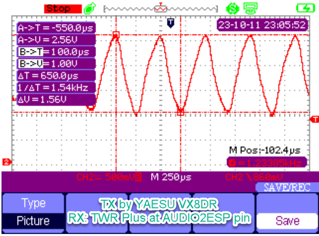
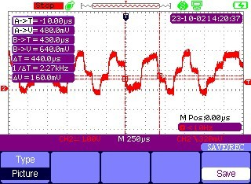
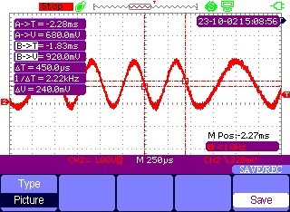
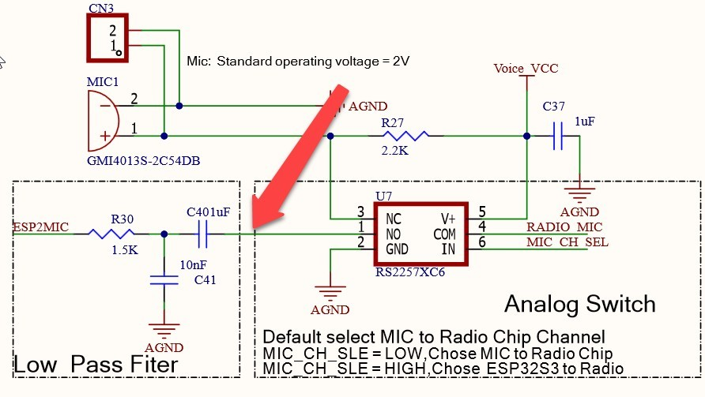
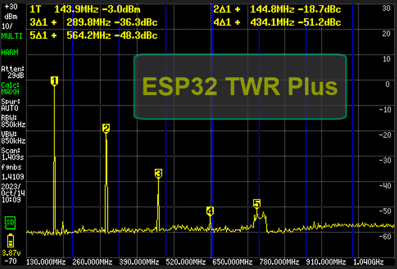

# ESP32-S3 howto ADC and DAC

The ESP32-S3 version has no DAC and no internal I2S.Therefore, another method must be used.

**ADC** Can use the operating mode of adc continue to DMA. \
The SA868 Module provides output signals at voltage levels <2Vp-p,it can use adc attention 11db no modifications hardware required.

## From the example in the picture

**DAC** Can use the operating mode of sigmadelta. \
Use the pulse width to determine the voltage level through the LPF generate signals, similar to PWM.

## Example AFSK signal sample 9600Hz in the picture

## Example AFSK signal sample 48,000Hz in the picture

## Measuring point of signal

# LILYGO T-TWR Plus most harmonic on RF

If you want to use it at a large station for igate/digi mode,Should be connected through a band pass filter(BPF).

